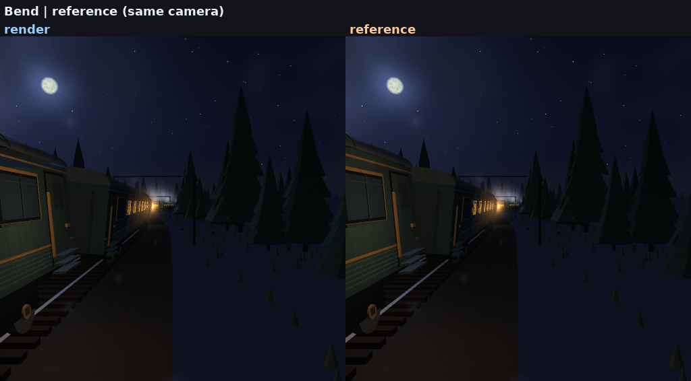

*English | [Русский](README.ru.md)*

# bend-night-train

**The Night Train on Bend 2** — a research project about the
[Bend 2](https://bend-lang.com/) language: affine dependent types, laws and
proofs, automatic parallelism.

The material is a self-contained WebGL demo, «Ночной поезд — из окна» (Night
train — from the window): a procedural track from two sine waves, a consist of
fifteen carriages, a night forest, stars, fog, light from the windows. It lives
in `reference/` and does not change. We rewrote it in Bend 2 to test by hand what
the language is capable of — and to write that down.

The rewrite is a **tile rasteriser**: a frame is a quadtree of tiles, each tile
carries only the triangles whose screen bounding box reaches it, and every pixel
is shaded once, by the triangle that won it. A 512x512 frame takes 0.19 s on 32
threads, and the renderer can be watched while it runs.


*Eight seconds of the same ride, both sides on the same camera —
`assets/video/compare-512.gif`; the H.264 original is `assets/video/compare-512.mp4`.*

## How close is it to the original

Both cameras are pinned to the demo's own ride (`s = 110`, yaw 0, pitch -0.02,
lean 1) and the reference is the original HTML rendered headlessly by
`tools/render_reference.py`, deterministically seeded.



*Render on the left, reference on the right, same camera at 512x512;
`assets/frames/compare-512-diff.png` is the amplified difference.*

| | 512x512 | 1024x1024 |
|---|---|---|
| mean absolute error | 0.002056 (0.52/255) | 0.001850 (0.47/255) |
| PSNR | 42.24 dB | 43.17 dB |
| largest single-pixel error | 0.431 | 0.404 |
| pixels off by more than 4/255 | 2.80 % | 2.20 % |

`make compare` renders the pair and the numbers; `make video` records the same
comparison as a clip, and every one of its 200 frames stays between 0.0021 and
0.0037 — the camera does not drift out of agreement as the ride advances. In the
still at 512x512 the remaining difference is not spread over the frame: it sits
in one band of the near carriage's side, where the wrong triangle wins those
pixels and takes the ambient light from the wrong end of the sky. The case is
written up in `docs/journal.md`; it is not fixed.

## Headline results

**1. It is fast enough to watch.**
`tools/live.sh` renders the ride to stdout as a PPM stream and pipes it to
`ffplay`: **5.6 fps at 256x256, 4.4 fps at 512x512** on 24 threads, one process
per frame. Off-line, a 512x512 frame is 0.19 s and a 1024x1024 frame 0.31 s at
32 threads.

**2. Parallelism keeps paying, unlike the ray marcher.**
The rasteriser speeds up **5.4x** at 1024x1024 on 32 threads (1.66 s -> 0.31 s)
and is still improving there, where the ray marcher this repository started with
was already slower at 32 threads than at 8. The frame digest is identical at
every thread count and depth. Numbers, method and their limits:
`docs/benchmarks.md`.

**3. What is provable is not what it seems.**
The laws gate (`bend PROOF.bend`) passes, but proves **structure**: the tile
recursion's shape and pixel count, the number of carriages, the number of
particles. The numbers are unprovable in principle — every `F32` operation is
declared as `law` without a body, so a pixel's colour and the camera position
cannot even be stated as a law. `docs/laws.md`.

**4. The language checks a lot, but wants its rules known in advance.**
The thirteen errors actually caught are listed in `docs/journal.md`; the
systematic reference is `docs/language-notes.md`. The most unusual: mutual
recursion is forbidden, declaration order is part of the program, `match` is not
an expression, and only a parameter can be destructured.

## Quick start

```sh
make proof                  # laws gate: must be "All terms check."
make build                  # native binary via clang
make frame                  # 512x512 frame to out/frame.png
make bench                  # sweep into bench/results.csv
make compare                # render + reference + metrics, 1024x1024
make video                  # record the clip: mp4, poster, gif

./tools/live.sh             # watch it render, in a window
./tools/bend src/main.bend  # check and run on the JS backend
```

Useful environment variables — for the finished binary:

```sh
NT_DEPTH=10 NT_S=150 NT_MOTION=0 NT_PPM=0 ./out/night-train --threads 16
```

| | |
|---|---|
| `NT_DEPTH` | quadtree depth; frame `2^d × 2^d` |
| `NT_S` | position along the track, metres |
| `NT_T` | animation clock, seconds (particles, window lights) |
| `NT_MOTION` | `1` — the ride's sway and bob, `0` — frozen |
| `NT_YAW`, `NT_PITCH` | pin the head; unset, the demo's auto-look decides |
| `NT_HEAD` | `1` — the head is out of the window |
| `NT_PPM` | `1` — write `out/frame.ppm`, `0` — only compute |
| `NT_VIEW` | `1` — stream frames to stdout instead of one file |
| `NT_FRAMES`, `NT_MS`, `NT_STEP` | frames, first frame's time, step between them |

`tools/bend` is a wrapper: in this environment `$HOME` is read-only, and a bare
`bend` cannot write to `~/.bend`.

The wrapper also **forbids `--publish`**. Bend's hub is a content-addressed store
with no accounts and no deletion: a published package stays public forever. Only
a human can lift the ban, by setting `BEND_ALLOW_PUBLISH=1`; an agent does not do
this.

## What's inside

| | |
|---|---|
| `src/raster.bend` | the tile quadtree: descend, render, PPM text |
| `src/rt.bend` | triangles, camera, projection, back-face culling |
| `src/shade.bend` | the fragment shader: windows, fog, tonemapping, sky |
| `src/world.bend` | track, ballast, ground, forest, hedges |
| `src/inst.bend` | the instanced scenery: poles, bushes, signals, dust |
| `src/carriage.bend` | the consist, carriage by carriage |
| `src/ride.bend` | the demo's camera: sway, bob, auto-look, lights |
| `src/geo.bend`, `src/trk.bend` | vector maths and the track's own geometry |
| `src/shape.bend` | the tile recursion without pixels — the laws are stated on it |
| `src/main.bend` | driver: environment, scene, frame, live stream |
| `LAWS.bend` / `PROOF.bend` | laws and proofs, the commit gate |
| `docs/benchmarks.md` | numbers and their analysis |
| `docs/laws.md` | what is provable, what is not, and why |
| `docs/language-notes.md` | language reference, everything verified by running |
| `docs/reference-demo-spec.md` | what the original demo does, down to the constants |
| `docs/journal.md` | chronology: what broke and how it was fixed |
| `docs/base-2.0.5.txt` | dump of `bend base` for version 2.0.5 — API reference |
| `tools/compare.py`, `tools/render_reference.py` | still comparison and the headless reference |
| `tools/compare_video.sh`, `tools/video_frames.py` | the comparison clip |
| `tools/live.sh`, `tools/clip.sh` | watch it live, or shoot a clip off-line |
| `tools/order.py` | topological sort of `def`s: declaration order is mandatory |
| `bench/` | benchmark driver and the exact measurer |

The ray-marching renderer this project started with is not gone: it lives on the
branch `legacy/raymarch` (tag `raymarch-legacy`). It is the only renderer whose
pixel is a pure function of the pixel, and the first laws were stated on it.

## What is not here

- **GPU speed-up numbers.** The `!` device lane was measured on this host: it
  changed nothing for this renderer — same digest, same host CPU time — and cost
  about 0.3 s per process, so it was removed. No claim is made either way about
  what a GPU does for a different workload. `probes/bench/bang.bend` and
  `docs/journal.md` have the measurements.
- **Comparison with hand-written C.** Bend already compiles to C; an honest
  comparison needs a C twin of the renderer.
- **A window of its own.** The renderer is headless and writes PPM; `tools/live.sh`
  is what puts it on screen, by piping frames into `ffplay`.

## What it cost

Two AI-assisted passes produced this repository, both on **DeepSeek Flash V4.1**:
the ray marcher on a DeepSeek harness, then the rasteriser on this branch with
Claude Code. The recorded spend for both together is **≈ $6.95**.

## License

MIT — see `LICENSE`. The original demo in `reference/` is the work of kvcop and
is distributed under the same terms.
