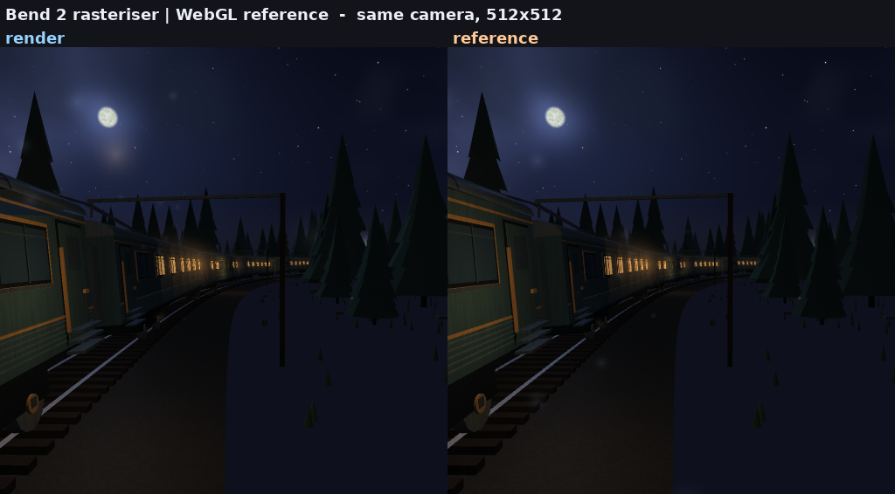

*[English](README.md) | Русский*

# bend-night-train

**«Ночной поезд» на Bend 2** — исследовательский проект про язык
[Bend 2](https://bend-lang.com/): аффинные зависимые типы, законы и
доказательства, автоматический параллелизм.

Материал — самодостаточная WebGL-демка «Ночной поезд — из окна»: процедурный
путь из двух синусоид, состав из пятнадцати вагонов, ночной лес, звёзды, туман,
свет из окон. Она лежит в `reference/` и не меняется. Мы переписали её на Bend 2,
чтобы руками проверить, что язык умеет, — и это записать.

Переписанная версия — **тайловый растеризатор**: кадр это квадродерево тайлов,
каждый тайл несёт только те треугольники, чей экранный bounding box до него
достаёт, и каждый пиксель закрашивается один раз — тем треугольником, который его
выиграл. Кадр 512x512 считается за 0.19 с на 32 потоках, и рендер можно смотреть
прямо во время работы.

[](assets/video/compare-512.mp4)

*Восемь секунд одной и той же поездки, обе стороны на одной камере —
`assets/video/compare-512.mp4`.*

## Насколько это похоже на оригинал

Обе камеры пришпилены к собственной поездке демки (`s = 110`, yaw 0, pitch -0.02,
lean 1), а эталон — оригинальный HTML, отрендеренный безголово через
`tools/render_reference.py` с детерминированным сидом.


*Слева рендер, справа эталон, одна и та же камера, 512x512;
`assets/frames/compare-512-diff.png` — усиленная разница.*

| | 512x512 | 1024x1024 |
|---|---|---|
| средняя абсолютная ошибка | 0.002056 (0.52/255) | 0.001850 (0.47/255) |
| PSNR | 42.24 dB | 43.17 dB |
| максимальная ошибка пикселя | 0.431 | 0.404 |
| пикселей с ошибкой больше 4/255 | 2.80 % | 2.20 % |

`make compare` рендерит пару и считает числа, `make video` записывает то же
сравнение клипом, и все его 200 кадров держатся между 0.0021 и 0.0037 — камера
не расходится по мере поездки. На стоп-кадре 512x512 остаток ошибки не размазан
по кадру: он сидит в одной полосе борта ближнего вагона, где эти пиксели
выигрывает не тот треугольник и берёт ambient-свет с не того конца неба.
Разбор — в `docs/journal.md`, починки нет.

## Главные результаты

**1. Это достаточно быстро, чтобы смотреть.**
`tools/live.sh` рендерит поездку в stdout потоком PPM и отдаёт его в `ffplay`:
**5.6 fps при 256x256, 4.4 fps при 512x512** на 24 потоках, по процессу на кадр.
Оффлайн кадр 512x512 — 0.19 с, кадр 1024x1024 — 0.31 с на 32 потоках.

**2. Параллелизм продолжает платить, в отличие от рейтрейсера.**
Растеризатор ускоряется в **5.4 раза** на кадре 1024x1024 и 32 потоках
(1.66 с -> 0.31 с) и на этом ещё не выдохся, тогда как рейтрейсер, с которого
проект начинался, на 32 потоках работал уже медленнее, чем на 8. Дайджест кадра
одинаков при любом числе потоков и на любой глубине. Числа, методика и её
границы — в `docs/benchmarks.md`.

**3. Доказуемо не то, чем кажется.**
Ворота законов (`bend PROOF.bend`) проходят, но доказывают **структуру**: форму
тайловой рекурсии и число пикселей, число вагонов, число частиц. Числа
недоказуемы в принципе: все операции над `F32` объявлены как `law` без тела,
поэтому ни цвет пикселя, ни положение камеры даже нельзя сформулировать законом.
`docs/laws.md`.

**4. Язык проверяет много, но требует знать правила заранее.**
Тринадцать реально пойманных ошибок перечислены в `docs/journal.md`,
систематический справочник — `docs/language-notes.md`. Самое необычное: взаимная
рекурсия запрещена, порядок объявлений — часть программы, `match` не выражение,
деструктурировать можно только параметр.

## Быстрый старт

```sh
make proof                  # ворота законов: должно быть "All terms check."
make build                  # нативный бинарник через clang
make frame                  # кадр 512x512 в out/frame.png
make bench                  # прогон в bench/results.csv
make compare                # рендер + эталон + метрики, 1024x1024
make video                  # записать assets/video/compare-512.mp4

./tools/live.sh             # смотреть, как он рендерит
./tools/bend src/main.bend  # проверка и запуск на JS-бэкенде
```

Полезные переменные окружения — для готового бинарника:

```sh
NT_DEPTH=10 NT_S=150 NT_MOTION=0 NT_PPM=0 ./out/night-train --threads 16
```

| | |
|---|---|
| `NT_DEPTH` | глубина квадродерева; кадр `2^d × 2^d` |
| `NT_S` | положение вдоль пути, метры |
| `NT_T` | часы анимации, секунды (частицы, свет в окнах) |
| `NT_MOTION` | `1` — качка и покачивание поездки, `0` — заморожено |
| `NT_YAW`, `NT_PITCH` | пришпилить голову; без них решает auto-look демки |
| `NT_HEAD` | `1` — голова высунута в окно |
| `NT_PPM` | `1` — писать `out/frame.ppm`, `0` — только посчитать |
| `NT_VIEW` | `1` — поток кадров в stdout вместо одного файла |
| `NT_FRAMES`, `NT_MS`, `NT_STEP` | кадров, время первого, шаг между ними |

`tools/bend` — обёртка: в этом окружении `$HOME` только для чтения, и голый
`bend` не может писать в `~/.bend`.

Обёртка ещё и **запрещает `--publish`**. Хаб Bend — контентно-адресуемое
хранилище без аккаунтов и без удаления: опубликованный пакет остаётся публичным
навсегда. Снять запрет может только человек, выставив `BEND_ALLOW_PUBLISH=1`;
агент этого не делает.

## Что внутри

| | |
|---|---|
| `src/raster.bend` | тайловое квадродерево: спуск, рендер, текст PPM |
| `src/rt.bend` | треугольники, камера, проекция, отсечение задних граней |
| `src/shade.bend` | фрагментный шейдер: окна, туман, тонмаппинг, небо |
| `src/world.bend` | путь, балласт, земля, лес, живые изгороди |
| `src/inst.bend` | инстансная мелочь: столбы, кусты, сигналы, пыль |
| `src/carriage.bend` | состав, вагон за вагоном |
| `src/ride.bend` | камера демки: качка, покачивание, auto-look, свет |
| `src/geo.bend`, `src/trk.bend` | векторная математика и геометрия пути |
| `src/shape.bend` | тайловая рекурсия без пикселей — на ней сформулированы законы |
| `src/main.bend` | драйвер: окружение, сцена, кадр, живой поток |
| `LAWS.bend` / `PROOF.bend` | законы и доказательства, ворота коммита |
| `docs/benchmarks.md` | числа и их разбор |
| `docs/laws.md` | что доказуемо, что нет и почему |
| `docs/language-notes.md` | справочник по языку, всё проверено запуском |
| `docs/reference-demo-spec.md` | что делает оригинальная демка, вплоть до констант |
| `docs/journal.md` | хронология: что сломалось и как починилось |
| `docs/base-2.0.5.txt` | дамп `bend base` версии 2.0.5 — справочник по API |
| `tools/compare.py`, `tools/render_reference.py` | сравнение стоп-кадров и безголовый эталон |
| `tools/compare_video.sh`, `tools/video_frames.py` | клип сравнения |
| `tools/live.sh`, `tools/clip.sh` | смотреть вживую или снять клип оффлайн |
| `tools/order.py` | топологическая сортировка `def`: порядок объявлений обязателен |
| `bench/` | драйвер бенчмарка и точный измеритель |

Рейтрейсер, с которого проект начинался, никуда не делся: он живёт в ветке
`legacy/raymarch` (тег `raymarch-legacy`). Это единственный рендерер, чей пиксель
— чистая функция пикселя, и первые законы были сформулированы на нём.

## Чего здесь нет

- **Чисел ускорения на GPU.** `!`-полоса устройства измерена на этом хосте: для
  этого рендерера она не меняла ничего — тот же дайджест, то же время host CPU —
  и стоила около 0.3 с на процесс, поэтому удалена. Про то, что GPU даёт другой
  нагрузке, здесь не утверждается ничего. Измерения — в `probes/bench/bang.bend`
  и `docs/journal.md`.
- **Сравнения с рукописным C.** Bend и так компилируется в C; честное сравнение
  требует C-близнеца рендерера.
- **Собственного окна.** Рендерер безголовый и пишет PPM; на экран его выводит
  `tools/live.sh`, отдавая кадры в `ffplay`.

## Сколько это стоило

Репозиторий сделан двумя AI-подходами, оба на **DeepSeek Flash V4.1**:
рейтрейсер — на harness с DeepSeek, затем растеризатор в этой ветке — с
Claude Code. Записанные расходы на оба вместе — **≈ $6.95**.

## Лицензия

MIT — см. `LICENSE`. Оригинальная демка в `reference/` — работа kvcop и
распространяется на тех же условиях.
