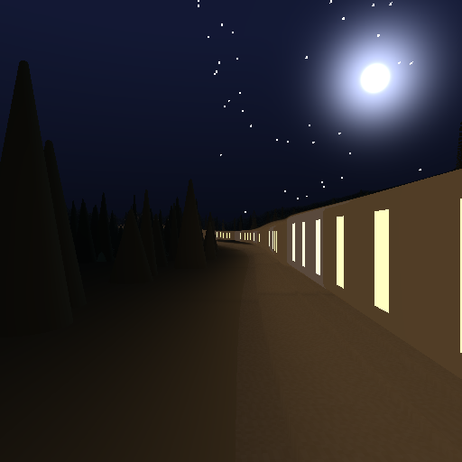

*[English](README.md) | Русский*

# bend-night-train

**Ночной поезд на Bend 2** — исследовательский проект о языке
[Bend 2](https://bend-lang.com/): аффинные зависимые типы, законы и
доказательства, автоматический параллелизм на CPU и GPU.

Материал — самостоятельная WebGL-демка «Ночной поезд — из окна»: процедурный
путь из двух синусоид, состав из пятнадцати вагонов, ночной лес, звёзды,
туман, свет из окон. Она лежит в `reference/` и не меняется. Мы переписали её
на Bend 2 не ради картинки, а чтобы руками проверить, на что язык способен —
и записать это.



## Главные результаты

**1. Параллелизм упирается в потолок задолго до числа ядер.**
Рендер кадра 1024×1024 на 32 ядрах ускоряется в **2.7×**, а суммарное
процессорное время при этом растёт в **8.2×**. На 32 потоках работа идёт
медленнее, чем на 8. Причина — неровная нагрузка: лучи трассируются за разное
число шагов, а планировщик не паркует простаивающие ядра, а крутит их.
Подробности и все числа: `docs/benchmarks.md`. (Это числа CPU-полосы;
повторный замер с GPU ожидается — см. `docs/benchmarks.md`.)

**2. Доказуемо не то, что кажется.**
Ворота законов (`bend PROOF.bend`) проходят, но доказывают **структуру**:
полноту четырёхдорожечного параллельного сплита, число вагонов, число лучей.
Числа недоказуемы в принципе: все операции над `F32` объявлены как `law` без
тела, поэтому цвет пикселя, положение камеры и «кадр не зависит от числа
потоков» нельзя даже сформулировать как закон. Разбор с дословными ошибками:
`docs/laws.md`.

**3. `!` исполняется на устройстве, а не на CPU.**
На этом хосте `!` — не откат на CPU: в машине стоит **RTX 4090 Laptop**
(драйвер 580.178.04, CUDA 13.0), `tools/bend` выставляет `CUDA_HOME=/usr` под
дистрибутивный тулчейн CUDA 12, `make build` порождает `out/night-train.gpu`,
а вызов `!` идёт на устройство даже без `--gpu`; `--gpu 4GB` только
ограничивает память устройства. Настоящая база CPU — `NT_BANG=0`. CPU и
устройство совпадают, кроме округления F32 в последнем бите (≤4/255 примерно
на 0.15 % пикселей), поэтому их контрольные коды могут отличаться.
Детерминизм проверен: 108 прогонов, три глубины, шесть значений `--threads`,
два варианта вызова — один и тот же результат.

**4. Язык проверяет многое, но требует знать правила заранее.**
Список из тринадцати реально пойманных ошибок — в `docs/journal.md`;
систематический справочник, собранный отдельным исследованием, — в
`docs/language-notes.md` (1170 строк). Самое непривычное: взаимная рекурсия
запрещена, порядок объявлений — часть программы, `match` — не выражение,
а деструктурировать можно только параметр.

## Быстрый старт

```sh
make proof                  # ворота законов: должно быть "All terms check."
make build                  # нативный бинарник через clang
make frame                  # кадр 512x512 в out/frame.png
make bench                  # 108 прогонов, bench/results.csv

./tools/bend src/main.bend   # проверка и запуск на JS-бэкенде
```

Полезные переменные окружения — у готового бинарника:

```sh
NT_DEPTH=10 NT_S=150 NT_SIDE=4.6 NT_PPM=0 ./out/night-train --threads 8
```

| | |
|---|---|
| `NT_DEPTH` | глубина квадродерева; кадр `2^d × 2^d` |
| `NT_S` | положение вдоль пути, метры |
| `NT_SIDE` | боковое смещение камеры от оси пути |
| `NT_PPM` | `1` — записать `out/frame.ppm`, `0` — только посчитать |
| `NT_BANG` | `1` — рендерить через `!`, `0` — обычным параллельным вызовом |

`tools/bend` — обёртка: в этой среде `$HOME` только для чтения, и голый
`bend` не может писать в `~/.bend`.

Обёртка ещё и **запрещает `--publish`**. Хаб Bend — контент-адресное
хранилище без аккаунтов и без удаления: опубликованный пакет остаётся
публичным навсегда. Снять запрет может только человек, выставив
`BEND_ALLOW_PUBLISH=1`; агент этого не делает.

## Что внутри

| | |
|---|---|
| `src/scene.bend` | мир: путь, состав, расстояния, трассировка, освещение |
| `src/color.bend` | упаковка цвета в `U32` для `Image` |
| `src/shape.bend` | скелет кадра без пикселей — на нём сформулированы законы |
| `src/main.bend` | безоконный драйвер: кадр, разворот квадродерева, PPM |
| `LAWS.bend` / `PROOF.bend` | законы и доказательства, ворота коммита |
| `docs/benchmarks.md` | числа и их разбор |
| `docs/laws.md` | что доказуемо, что нет и почему |
| `docs/language-notes.md` | справочник по языку, всё проверено запуском |
| `docs/reference-demo-spec.md` | что делает оригинальная демка, до констант |
| `docs/journal.md` | хронология: что сломалось и как починили |
| `docs/base-2.0.5.txt` | дамп `bend base` для версии 2.0.5 — справочник по API |
| `tools/order.py` | топологическая сортировка `def`: порядок объявлений обязателен |
| `tools/storyboard.py` | серия кадров вдоль пути → GIF и MP4 |
| `tools/ppm2png.py` | PPM → PNG без библиотек |
| `bench/` | драйвер бенчмарков и точный измеритель |

## Как это устроено

Кадр — это `Image`-квадродерево. Каждый уровень строится одним параллельным
вызовом на четыре части:

```python
a b c f = Scene.frame(e, x, y, cam, cars)
  Scene.frame(e, x1, y, cam, cars)
  Scene.frame(e, x, y1, cam, cars)
  Scene.frame(e, x1, y1, cam, cars)
Qua{a, b, c, f}
```

Это единственное место, где работа делится; всё остальное — чистые функции от
координат. Пиксель — трассировка луча: аналитические пересечения с землёй,
насыпью, рельсами и вагонами, круглые конусы вместо ёлок, небо со звёздами и
луной, туман и тонмаппинг по формулам оригинала.

Земля, лес и вагоны сведены к минимуму, достаточному для узнаваемого кадра:
нет рельефа с шумом, нет столбов контактной сети, нет деревень. Это
осознанные упрощения, а не недоделки — они перечислены в шапке
`src/scene.bend`.

## Чего здесь нет

- **Чисел ускорения на GPU.** Полоса устройства работает (см. результат 3), но
  никаких цифр времени на GPU здесь не заявлено: обещанные сайтом «до ста раз
  на GPU» не проверялись и не утверждаются.
- **Сравнения с рукописным C.** Bend и так компилируется в C; честное
  сравнение требует C-близнеца рендера.
- **Интерактивного окна.** `App.run` в языке есть, но окна в этой среде нет;
  всё безоконное, кадр пишется в PPM.

## Лицензия

MIT — см. `LICENSE`. Оригинальная демка в `reference/` — работа kvcop и
распространяется на тех же условиях.
