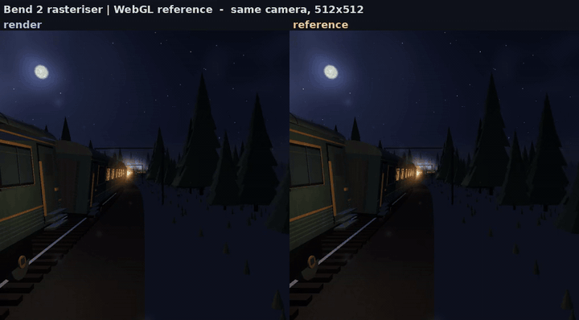
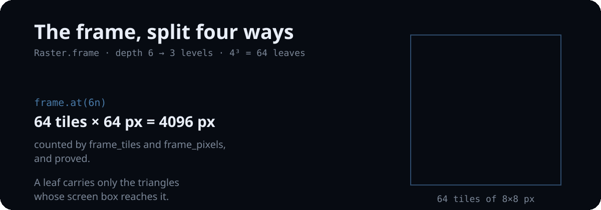

*[English](README.md) | Русский*

# bend-night-train

**«Ночной поезд» на Bend 2** — самодостаточная WebGL-демка «Ночной поезд — из окна»,
переписанная на [Bend 2](https://bend-lang.com/) тайловым растеризатором: чтобы руками
выяснить, что умеет язык, — аффинные зависимые типы, законы и доказательства,
автоматический параллелизм. Картинка держится в пределах 0.52/255 от оригинала, и
рендер достаточно быстр, чтобы на него смотреть.

Оригинал лежит в `reference/` и не меняется — [скачать
оригинал](https://github.com/kvcop/bend-night-train/raw/main/reference/night-train-webgl.html)
и открыть в браузере.



*Восемь секунд одной и той же поездки, обе стороны на одной камере —
`assets/video/compare-512.gif`; исходник в H.264 — `assets/video/compare-512.mp4`.*

## Насколько это похоже на оригинал

Обе камеры пришпилены к собственной поездке демки (`s = 110`, yaw 0, pitch -0.02,
lean 1); эталон — оригинальная страница, отрендеренная безголово через
`tools/render_reference.py` с детерминированным сидом.

| | 512×512 | 1024×1024 |
|---|---|---|
| средняя абсолютная ошибка | 0.002056 (0.52/255) | 0.001850 (0.47/255) |
| PSNR | 42.24 dB | 43.17 dB |
| максимальная ошибка пикселя | 0.431 | 0.404 |
| пикселей с ошибкой больше 4/255 | 2.80 % | 2.20 % |

Все кадры клипа держатся между 0.0021 и 0.0037, то есть камера не расходится по мере
поездки. На стоп-кадре остаток ошибки не размазан по кадру: он сидит в одной полосе
борта ближнего вагона, где эти пиксели выигрывает не тот треугольник. Разбор — в
`docs/journal.md`, починки нет.

## Что это такое

Кадр — это квадродерево тайлов. Лист владеет блоком 8×8 пикселей и несёт только те
треугольники и билборды, чей экранный бокс до него дотягивается, поэтому каждый
пиксель затеняется один раз — тем треугольником, который его выиграл.



Модули, пять стадий одного кадра и четверное деление —
[`docs/ru/structure.md`](docs/ru/structure.md).

## Числа

- **0.31 с** на кадр 1024×1024 и 32 потоках — в 5.4 раза быстрее, чем на одном потоке
  (1.66 с), — и дайджест кадра одинаков при любом числе потоков. Кадр 512×512 — 0.19 с.
- **5.6 и 4.4 fps** вживую на 256×256 и 512×512 при 24 потоках, по процессу на кадр:
  достаточно медленно, чтобы разглядеть, и достаточно быстро, чтобы следить.
- **Законы доказывают структуру, а не числа.** Число тайлов и пикселей, полнота
  четверного деления и длина состава проверяются. Цвет пикселя даже *сформулировать*
  законом нельзя: каждая операция над `F32` объявлена законом без тела.
- **Язык требует знать свои правила заранее:** порядок объявлений — часть программы,
  взаимная рекурсия запрещена, `match` не выражение, деструктурировать можно только
  параметр.

Числа, методика и их границы — [`docs/ru/benchmarks.md`](docs/ru/benchmarks.md). Что
доказано и почему остальное нельзя — [`docs/ru/laws.md`](docs/ru/laws.md). Тринадцать
реально пойманных ошибок языка — [`docs/ru/language-notes.md`](docs/ru/language-notes.md).

## Запуск

```sh
make proof                  # ворота законов: должно быть "All terms check."
make build && make frame    # нативный бинарник, кадр 512x512 в out/frame.png
make compare                # рендер + эталон + метрики, 1024x1024
make video                  # клип выше: mp4, постер, gif

./tools/live.sh             # смотреть, как он рендерит
```

Переменные окружения, живой поток и инструменты сравнения —
[`docs/ru/running.md`](docs/ru/running.md). Всё остальное — в
[`docs/ru/`](docs/ru/README.md).

## Чего здесь нет

- **Чисел на GPU.** `!`-полоса устройства измерена на этом хосте: для этого рендерера
  она не меняла ничего — тот же дайджест, то же время host CPU — и стоила около 0.3 с
  на процесс, поэтому удалена. Про другую нагрузку здесь не утверждается ничего.
- **Сравнения с рукописным C.** Bend и так компилируется в C; честное сравнение требует
  C-близнеца рендерера.
- **Собственного окна.** Рендерер безголовый и пишет PPM; на экран его выводит
  `tools/live.sh`.

## Сколько это стоило

Репозиторий сделан двумя AI-подходами, оба на **DeepSeek Flash V4.1**: рейтрейсер — на
harness с DeepSeek, затем растеризатор в этой ветке — с Claude Code. Записанные расходы
на оба вместе — **≈ $6.95**.

## Лицензия

MIT — см. `LICENSE`. Оригинальная демка в `reference/` — работа kvcop и
распространяется на тех же условиях.
