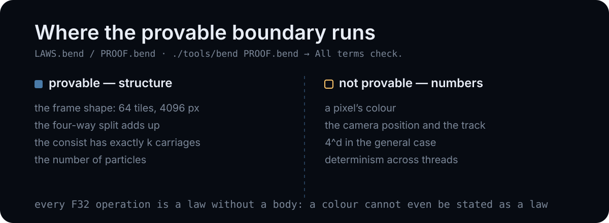

*English | [Русский](ru/laws.md)*

# Laws: what is actually provable in Bend 2

`LAWS.bend` holds the statements, `PROOF.bend` the proofs, `bend PROOF.bend` the
gate. They pass and print `All terms check.` in about 0.2 s.

```sh
./tools/bend PROOF.bend
# All terms check.
```

This text is a report on where the boundary of the provable runs and why. The
boundary turned out not to be where I expected: it runs not between "complex"
and "simple", but between **structure and numbers**.

## 1. What is proved

The statements are made on `src/shape.bend`, the frame's skeleton: the same tile
recursion the rasteriser runs, with `Tile{0}` in place of a shaded tile. A leaf
owns an 8x8 block of pixels, and the frame depth `d` is the renderer's depth
minus the tile's three fixed levels -- `Shape.frame.at(d)` shaves them exactly as
`Raster.frame` does.

### `consist_slots` — the consist's index sequence has exactly length k

```python
law consist_slots:
  for k: Nat
  {List.length(&2, Nat, Scene.slots(k)) == k : Nat}
```

The consist is built by walking `Scene.slots(k)`, the list `[k-1, …, 1, 0]`. A
carriage's geometry is F32 and unprovable (see §2), but **an off-by-one in the
carriage count** is checkable. The proof is induction on `k`; the step rests on
the fact that `List.length` of a cons is by definition `1n + length(tail)`:

```python
def Laws.consist_slots(k):
  match k:
    case 0n:
      {==}
    case 1n+p:
      %Laws.consist_slots(p) : {1n+List.length(&2, Nat, Scene.slots(p))
        == 1n+_ : Nat}
      {==}
```

For this law `Scene.consist` had to be split into `Scene.slots` (numbers) and
`Scene.consist.list` (geometry). This is not cosmetic: while the indices and the
sines lived in one function, the statement was inexpressible.

### `quad_pixels` — the four-way parallel split loses nothing

```python
law quad_pixels:
  for a: Shape.Frame
  for b: Shape.Frame
  for c: Shape.Frame
  for e: Shape.Frame
  {Shape.pixels(Shape.Quad{a, b, c, e}) ==
     Nat.add(pixels(a), add(pixels(b), add(pixels(c), pixels(e)))) : Nat}
```

It is proved by reflexivity (`{==}`): this is literally the definition of
`Shape.pixels`. The value is not in the depth but in the fact that the law guards
**the cut point**: `Quad{a,b,c,e}` is exactly the node that the parallel call
`a b c e = frame(...) frame(...) frame(...) frame(...)` builds. If someone swaps
the order or drops a branch during a refactor, the law breaks.

### `frame8` — one tile at its own depth is exactly 64 pixels

```python
law frame8:
  {Shape.pixels(Shape.frame.at(3n)) == 64n : Nat}
```

Depth 3 is the tile's own depth (`Tile.levels()`), so this is one leaf: 8x8 =
64. It is checked by evaluation, and it is what pins the tile's side and the
depth shaving: change either and the count moves.

### `frame_tiles` — frame depth 6 is exactly 64 tiles

```python
law frame_tiles:
  {Shape.tiles(Shape.frame.at(6n)) == Nat.pow(4n, 3n) : Nat}
```

`frame.at(6n)` is 6 - 3 = 3 levels of four-way split, so 4^3 = 64 leaves. This is
the law that catches a lost or duplicated subtree in the split.

### `frame_pixels` — frame depth 6 is exactly 4096 pixels

```python
law frame_pixels:
  {Shape.pixels(Shape.frame.at(6n)) ==
     Nat.mul(Nat.pow(2n, 6n), Nat.pow(2n, 6n)) : Nat}
```

64 tiles of 64 pixels. `quad_pixels` says the join adds up; this says the whole
frame is the size it claims, so a change to the tile's side cannot slip past.

### The gate really is closed

Checked with a negative test: `probes/neg/PROOF_bad.bend` is `frame8` with the
claim changed to 16.

```
$ ./tools/bend probes/neg/PROOF_bad.bend
Error:
- expected : 64n
- observed : 16n
Location: frame8
```

## 2. What cannot be proved

### F32 is opaque

Let us try the simplest law about floating-point numbers:

```python
law f32_add_zero:
  for x: F32
  {F32.add(x, 0.0) == x : F32}
```

```
$ ./tools/bend probes/limits/PROOF_f32.bend
Error:
- expected : F32.add(x, 0.0)
- observed : x
Context:
- x : F32
```

The reason is visible in `bend base F32`: **all** operations on F32 are declared
as `law`, not `def`:

```
law F32.add:
  for a: F32
  for b: F32
  F32
```

A `law` has no body. The checker knows nothing about them and cannot simplify
anything except literally identical terms. So:

- a pixel's colour;
- the camera position;
- the values of `Track.x`/`Track.y`;
- "the frame does not depend on the number of threads";
- "brightness within [0,255]"

— all of this is **inexpressible** in current Bend 2. Not "hard to prove", but
impossible even to state as a law. That is precisely why `src/shape.bend` exists:
the laws about the frame are stated on its **skeleton** — the same recursion with
the same parallel call, but with a constant in place of the colour. The structure
is provable, the pixels are not.

The official demo confirms this too: `demos/app_ray_tracer_3d/LAWS.bend` begins
with the words "The F32 scene is not claimed" — the language's authors ran into
exactly the same wall.

### The general 4^d law runs into arithmetic Base does not have

The natural generalisation of `frame_tiles` is "a depth-`d` frame contains
exactly 4^d tiles". `probes/limits/PROOF_gen.bend` states it in its smallest
form, with the tree replaced by its count and the same induction step:

```python
def four(+d: Nat) -> Nat:
  match d:
    case 0n:
      1n
    case 1n+p:
      Nat.add(four(p), Nat.add(four(p), Nat.add(four(p), four(p))))

law four_is_pow:
  for d: Nat
  {four(d) == Nat.pow(4n, d) : Nat}
```

The induction reaches the step and stops:

```
$ ./tools/bend probes/limits/PROOF_gen.bend
Error:
- expected : {Nat.add(four(p), Nat.add(four(p), Nat.add(four(p), four(p)))) == Nat.add(Nat.pow(4n, p), Nat.add(Nat.pow(4n, p), Nat.add(Nat.pow(4n, p), Nat.add(Nat.pow(4n, p), 0n)))) : Nat}
- observed : {four(p) == Nat.pow(4n, p) : Nat}
Context:
- p : Nat
```

Read the two lines together and the gap is clear. `expected` is the step's goal
after both sides were unfolded — `four(1n+p)` becomes a four-fold sum of
`four(p)`, and `pow(4n, 1n+p)` a four-fold sum of `pow(4n, p)` ending in
`Nat.add(…, 0n)`. The proof offers a hypothesis about a single `four(p)`, at the
top level; nothing lifts it to the sum, because there is no tactic and no rewrite
rule to apply it with. The step stops there. Behind that sit two arithmetic facts: the goal's right side
ends in `Nat.add(…, 0n)` where the left has a bare `four(p)`, so `x + 0 = x` is
needed, and the sums are nested differently, so associativity is needed. Base
supplies neither: `bend base Nat` shows the definitions of `add`, `mul`, `pow`,
`double` and **not a single lemma** about their algebra.

The official answer to this is the `demos/proof_numerics` demo: it redefines
`add`/`mul` and proves `add_comm`, `add_assoc`, `mul_comm`, `mul_dist`. There is
no other way: Bend has no tactics, no rewrite search, every associativity step is
written by hand.

The practical conclusion for law-driven development: **any program that contains
arithmetic first pays for an arithmetic library**. For this renderer that would
mean: prove `x+0=x`, prove associativity, then generalise `frame_tiles` to 4^d.
The five laws that exist now do not require that payment — they rest on the
structure of the list and the tree, and are decided by evaluation.

## 3. What this means



| | provable | unprovable |
|---|---|---|
| frame shape, number of tiles and pixels | yes | |
| completeness of the parallel split | yes | |
| number of carriages | yes | |
| colours, lighting, fog | | F32 is opaque |
| camera position and track | | F32 is opaque |
| `4^d` in the general case | | no algebra of Nat in Base |
| determinism across threads | | a consequence of F32 |

The last row is a separate irony. The renderer's determinism is **measured** —
`bench/results.csv` holds 54 runs over depths 8, 9 and 10 and thread counts 1 to
32, and the frame's digest is one value per depth — but **not proved**: to state
it you would need equations over F32 values, and the checker does not have them.

The result is an honest picture for this project: the laws gate catches errors of
**structure** — a lost quadtree branch, an extra or missing carriage, broken
recursion — and does not catch errors in **numbers**. That is far more than
nothing, but noticeably less than the word "proof" on the cover promises.
