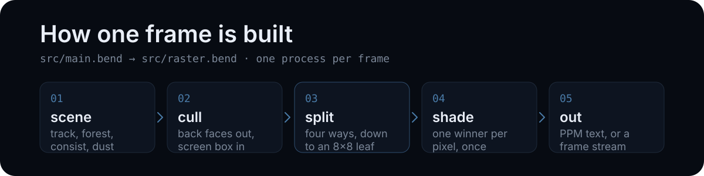
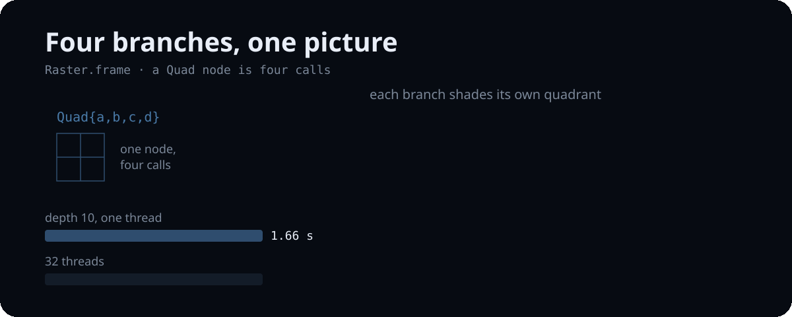

*[English](../structure.md) | Русский*

# Как устроен рендерер

Кадр — это квадродерево тайлов. Лист владеет блоком 8x8 пикселей и несёт только те
треугольники и билборды, чей экранный бокс до него дотягивается, поэтому каждый
пиксель затеняется один раз — тем треугольником, который его выиграл.

## Кадр, разделённый на четыре

На глубине 6 кадр — это 64x64 пикселя, то есть дерево глубины три уровня
четверного деления, а его 64 листа — по 8x8 пикселей. Оба числа — законы:
`frame_tiles` и `frame_pixels`; `frame8` закрепляет один лист в 64 пикселя.
Утверждения живут в `src/shape.bend` — та же рекурсия с константой на месте
цвета; почему сами пиксели законом не сформулировать, — в [laws.md](laws.md).

## Почему четверное деление окупается

Четыре ветки узла `Quad` — это четыре вызова в исходнике, а где они выполняются,
решает рантайм. На глубине 10 wall-время падает с 1.66 с на одном потоке до 0.31 с
на 32 потоках — 5.4x, и потолка пока не видно, — а дайджест кадра одинаков при любом
числе потоков: картинка не зависит от порядка обхода. Числа, методика и границы
измерения — в [benchmarks.md](benchmarks.md).

## Модули

| | |
|---|---|
| `src/raster.bend` | тайловое квадродерево: спуск, рендер, текст PPM |
| `src/rt.bend` | треугольники, камера, проекция, отсечение задних граней |
| `src/shade.bend` | фрагментный шейдер: окна, туман, тонмаппинг, небо |
| `src/world.bend` | путь, балласт, земля, лес, живые изгороди |
| `src/inst.bend` | инстансная мелочь: столбы, кусты, сигналы, пыль |
| `src/carriage.bend` | состав, вагон за вагоном |
| `src/ride.bend` | камера демки: качка, покачивание, auto-look, свет |
| `src/geo.bend`, `src/trk.bend` | векторная математика и геометрия пути |
| `src/shape.bend` | тайловая рекурсия без пикселей — на ней сформулированы законы |
| `src/main.bend` | драйвер: окружение, сцена, кадр, живой поток |
| `LAWS.bend` / `PROOF.bend` | законы и доказательства, ворота коммита |

`tools/order.py` сортирует `def` топологически перед сборкой: порядок объявлений —
часть программы на Bend, поэтому порядок в файлах не свободен.

Рейтрейсер, с которого проект начинался, живёт в ветке `legacy/raymarch`
(тег `raymarch-legacy`). Это единственный рендерер, чей пиксель — чистая функция
пикселя, и первые законы были сформулированы на нём.
